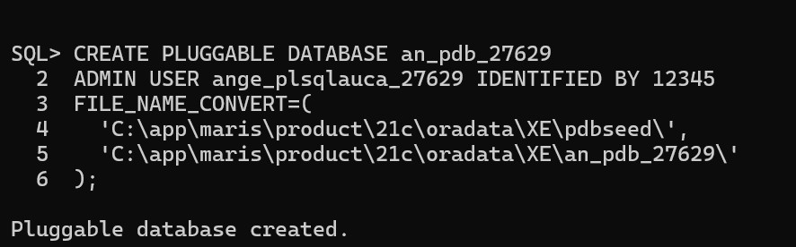
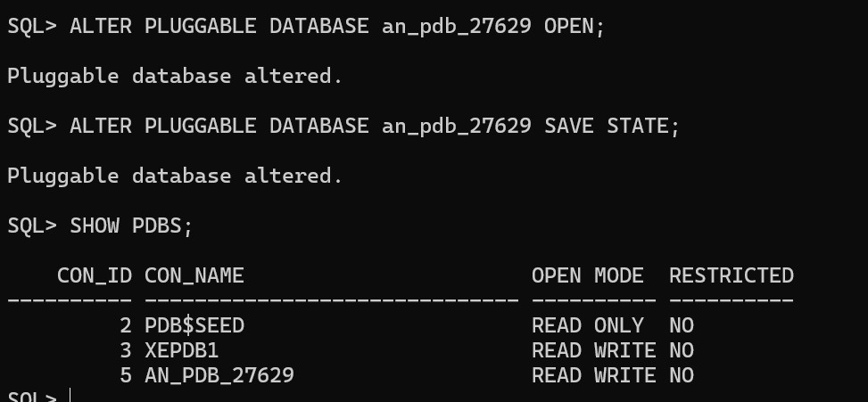
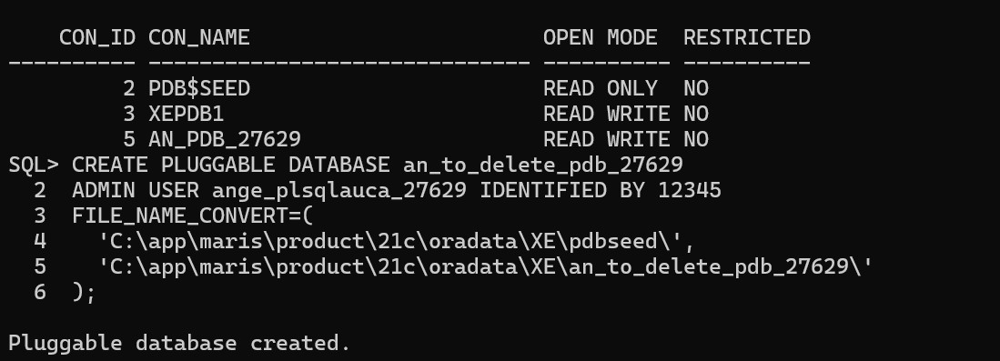
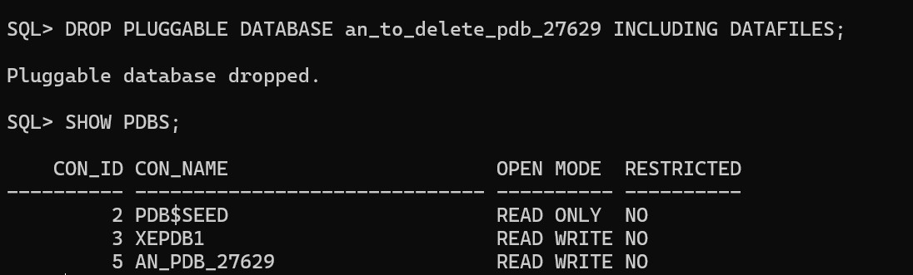

Oracle Pluggable Database (PDB) Practical

## Student Information
**Name:** Uwimbabazi Ange  
**Student ID:** 27629  
**Course:** PL/SQL and Database Administration  


## Overview

This project demonstrates how to:
1. **Create a new Pluggable Database (PDB)**  
2. **Create and delete another PDB**  
3. **Configure and access Oracle Enterprise Manager (OEM Express)**  

All tasks were performed in **Oracle Database 21c Express Edition (XE)** on **Windows**.

---

##  Task 1: Create a New PDB

### Steps
1. Connect as SYSDBA and switch to root container:
   ```sql
   sqlplus / as sysdba
   ALTER SESSION SET CONTAINER=CDB$ROOT;
   SHOW CON_NAME;
   ```
   CREATING PDB
   ```sql
   CREATE PLUGGABLE DATABASE AN_PDB_27629
   ADMIN USER ANGE_PLSQLAUCA_27629 IDENTIFIED BY 12345
   FILE_NAME_CONVERT=(
   'C:\\app\\maris\\product\\21c\\oradata\\XE\\pdbseed\\',
   'C:\\app\\maris\\product\\21c\\oradata\\XE\\AN_PDB_27629\\'
   );
   ```
   '

 ```SQL
 ALTER PLUGGABLE DATABASE AN_PDB_27629 OPEN;
 ALTER PLUGGABLE DATABASE AN_PDB_27629 SAVE STATE;
 SHOW PDBS;
 ```
   '
   
Task 2: Create and Delete Another PDB
 Steps

Create a second PDB:
```sql
CREATE PLUGGABLE DATABASE AN_TO_DELETE_PDB_27629
ADMIN USER ANGE_PLSQLAUCA_27629 IDENTIFIED BY 12345
FILE_NAME_CONVERT=(
  'C:\\app\\maris\\product\\21c\\oradata\\XE\\pdbseed\\',
  'C:\\app\\maris\\product\\21c\\oradata\\XE\\AN_TO_DELETE_PDB_27629\\'
);
```
   '

Delete the PDB:
```sql
ALTER PLUGGABLE DATABASE AN_TO_DELETE_PDB_27629 CLOSE IMMEDIATE;
DROP PLUGGABLE DATABASE AN_TO_DELETE_PDB_27629 INCLUDING DATAFILES;
```
   '


Delete the PDB:

ALTER PLUGGABLE DATABASE AN_TO_DELETE_PDB_27629 CLOSE IMMEDIATE;
DROP PLUGGABLE DATABASE AN_TO_DELETE_PDB_27629 INCLUDING DATAFILES;
SHOW PDBS;

🖼️ Screenshot Placeholders

